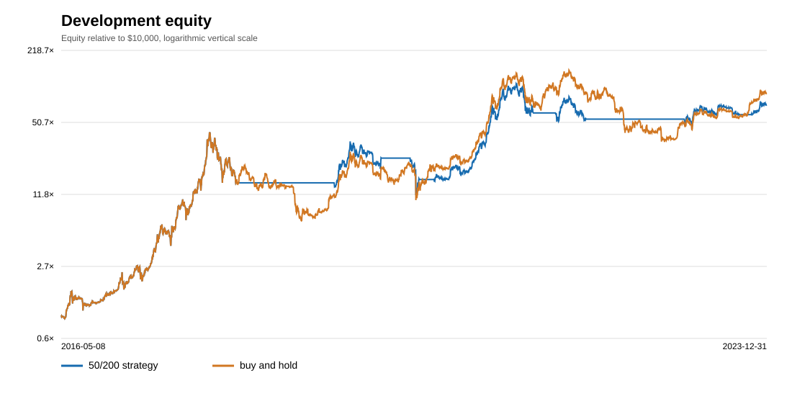

# Keel: BTC/USD daily moving-average study

**License:** [Original code: MIT](../LICENSE). [Bundled data and data-derived reports: CC BY-NC-SA 4.0](../DATA_LICENSE.md), which restricts commercial use. Commercial use of the data requires a separate license from CryptoDataDownload.

## Data and reproduction

Run `./run.sh` from a clone with Python 3.10+ and Git. It runs the standard-library tests and rebuilds this report, the CSV equity curves, and the SVG charts offline.

The snapshot has 3,915 consecutive UTC daily BTC/USD OHLCV bars from 2015-09-01 through 2026-05-20. Its SHA-256 is `f3ee2056ec870ab104c9c54fc23b238c86775a0749916231139c14c5751ef21f`. It comes from [CryptoDataDownload's Bitstamp daily file](https://www.cryptodatadownload.com/data/bitstamp/), licensed under [CC BY-NC-SA 4.0](https://creativecommons.org/licenses/by-nc-sa/4.0/).

In 911 older rows, the source reverses its BTC and USD volume headings. The importer checked each row's implied price against its OHLC range before choosing BTC volume. The source also has a partial 2026-05-21 bar and no 2026-05-22 bar. The loader rejects gaps, duplicates, invalid prices, and checksum changes. `python3 -m keel.fetch` contains the acquisition code; the included snapshot is the reproducible input. See `DATA_LICENSE.md` for attribution.

## Rules and assumptions

Both portfolios start with $10,000 cash, with no leverage, shorting, or interest. After each completed UTC daily bar, the strategy compares the trailing 50- and 200-day closing-price averages. It holds BTC when the faster average is strictly above the slower one. A changed target fills at the *next* bar's open. A buy uses all available cash and rounds BTC down to 0.00000001; a flat signal sells the whole position. The benchmark buys at the first evaluation open and holds. Both pay the same assumed costs.

Base costs per side are 60 basis points in fees and 10 basis points of adverse slippage. The stress run uses 100 and 30 basis points. These are research assumptions, not a current Bitstamp fee quote. Equity is marked at each daily close, and the final position is left open. Entry-day simple returns include the move from the open to the close.

CAGR uses 365.2425 days per year. Volatility is the sample standard deviation of daily returns times the square root of 365.2425. Sharpe assumes a zero risk-free rate. Maximum drawdown includes starting equity. Turnover sums executed notional divided by the preceding close's equity. Each completed buy or sell counts as a trade.

The first 250 bars supply indicator history. Development ends before 2024-01-01. The out-of-sample portfolio starts with fresh cash on that date, although its signal can use completed closes from the development period.

## Development (2016-05-08 to 2023-12-31)

| Portfolio | CAGR | Volatility | Sharpe | Max drawdown | Turnover | Trades | Final equity |
|---|---:|---:|---:|---:|---:|---:|---:|
| 50/200 strategy | 75.00% | 61.88% | 1.22 | -72.07% | 12.95× | 13 | $723,186.06 |
| Buy and hold | 80.45% | 73.45% | 1.17 | -83.43% | 0.99× | 1 | $914,308.13 |

From 2017-12-16 to 2020-03-12, the strategy's close-to-close drawdown reached -72.07%. Its CAGR was 5.45 percentage points lower than buy and hold.

## Development sensitivity

Each run uses the same development dates and starts with fresh cash. Only the sealed 50/200 setting with base costs went into the holdout.

| Fast / slow | Fee / slippage (bps) | CAGR | Sharpe | Max drawdown | Turnover | Trades |
|---|---:|---:|---:|---:|---:|---:|
| 40/180 | 60/10 | 73.49% | 1.21 | -69.39% | 12.95× | 13 |
| 40/180 | 100/30 | 71.73% | 1.19 | -69.75% | 12.91× | 13 |
| 40/200 | 60/10 | 72.92% | 1.20 | -74.66% | 12.95× | 13 |
| 40/200 | 100/30 | 71.16% | 1.19 | -75.26% | 12.91× | 13 |
| 50/180 | 60/10 | 74.48% | 1.22 | -71.64% | 12.96× | 13 |
| 50/180 | 100/30 | 72.71% | 1.20 | -72.32% | 12.92× | 13 |
| 50/200 | 60/10 | 75.00% | 1.22 | -72.07% | 12.95× | 13 |
| 50/200 | 100/30 | 73.23% | 1.20 | -72.73% | 12.91× | 13 |
| 50/220 | 60/10 | 77.02% | 1.24 | -67.22% | 12.95× | 13 |
| 50/220 | 100/30 | 75.22% | 1.22 | -67.99% | 12.91× | 13 |
| 60/200 | 60/10 | 79.60% | 1.26 | -67.82% | 12.95× | 13 |
| 60/200 | 100/30 | 77.78% | 1.24 | -68.58% | 12.91× | 13 |
| 60/220 | 60/10 | 75.74% | 1.22 | -70.03% | 12.95× | 13 |
| 60/220 | 100/30 | 73.96% | 1.21 | -70.74% | 12.91× | 13 |
