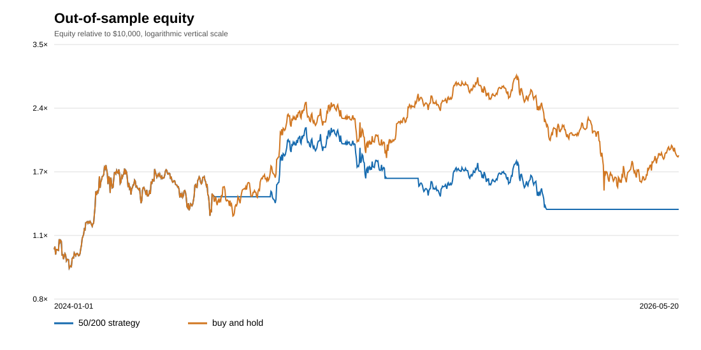

# BTC-USD daily moving-average research

## Reproduction and source

Run `./run.sh` from a clone with Python 3.10+ and Git. It runs the standard-library test suite and regenerates this report, its CSV equity curves, and SVG charts without a network request.

The pinned dataset contains 3915 consecutive UTC daily BTC-USD OHLCV bars from 2015-09-01 through the day before 2026-05-21. SHA-256: `f3ee2056ec870ab104c9c54fc23b238c86775a0749916231139c14c5751ef21f`. Source: [CryptoDataDownload's Bitstamp BTC/USD daily file](https://www.cryptodatadownload.com/data/bitstamp/), licensed [CC BY-NC-SA 4.0](https://creativecommons.org/licenses/by-nc-sa/4.0/). The source's BTC and USD volume headings are reversed in 911 older rows; we chose the smaller field as BTC volume only after verifying the implied USD/BTC price against each day's OHLC range. The source later contains a partial 2026-05-21 bar and no 2026-05-22 bar, so this pinned study ends on 2026-05-20. The loader rejects gaps, duplicates, invalid prices, and checksum changes. `python3 -m quantlab.fetch` documents the acquisition code; the checked-in snapshot is the reproducible input. See `DATA_LICENSE.md` for attribution.

## Rules and assumptions

Start with $10,000 cash, no leverage, no shorting, and no interest. After each completed UTC daily bar, compare its trailing 50- and 200-day closing-price averages. Hold BTC only when the faster average is strictly above the slower one. Fill a changed target at the *next* bar's open. All available cash buys BTC rounded down to 0.00000001 BTC; a flat signal sells all BTC. The benchmark buys at the first evaluation open and holds. Both portfolios pay the same assumed costs.

Base costs per side: 60 basis points fee plus 10 basis points adverse slippage. Stress costs: 100 and 30 basis points. These are research assumptions, not a current Bitstamp fee quote. Equity is marked at the daily close; the last position is not liquidated. Daily simple returns include open-to-close P&L on entry days. CAGR uses 365.2425 days per year; volatility is sample standard deviation times its square root; Sharpe uses a zero risk-free rate; maximum drawdown includes starting equity. Turnover is the sum of executed notional divided by the preceding close's equity. Trades count completed buy or sell executions.

The first 250 bars are indicator history only. Development ends before 2024-01-01; the independent out-of-sample portfolio starts with fresh cash on that date while its signal may use earlier completed development closes.

## Development (2016-05-08 to 2023-12-31)

| Portfolio | CAGR | Volatility | Sharpe | Max drawdown | Turnover | Trades | Final equity |
|---|---:|---:|---:|---:|---:|---:|---:|
| 50/200 strategy | 75.00% | 61.88% | 1.22 | -72.07% | 12.95× | 13 | $723,186.06 |
| Buy and hold | 80.45% | 73.45% | 1.17 | -83.43% | 0.99× | 1 | $914,308.13 |

The strategy's deepest close-to-close drawdown was -72.07% from 2017-12-16 to 2020-03-12. Its CAGR difference versus buy and hold was -5.45 percentage points.

## Development sensitivity

Each row uses the identical development dates and starts with fresh cash. Only the sealed 50/200 base-cost setting is evaluated out of sample.

| Fast / slow | Fee / slippage (bps) | CAGR | Sharpe | Max drawdown | Turnover | Trades |
|---|---:|---:|---:|---:|---:|---:|
| 40/180 | 60/10 | 73.49% | 1.21 | -69.39% | 12.95× | 13 |
| 40/180 | 100/30 | 71.73% | 1.19 | -69.75% | 12.91× | 13 |
| 40/200 | 60/10 | 72.92% | 1.20 | -74.66% | 12.95× | 13 |
| 40/200 | 100/30 | 71.16% | 1.19 | -75.26% | 12.91× | 13 |
| 50/180 | 60/10 | 74.48% | 1.22 | -71.64% | 12.96× | 13 |
| 50/180 | 100/30 | 72.71% | 1.20 | -72.32% | 12.92× | 13 |
| 50/200 | 60/10 | 75.00% | 1.22 | -72.07% | 12.95× | 13 |
| 50/200 | 100/30 | 73.23% | 1.20 | -72.73% | 12.91× | 13 |
| 50/220 | 60/10 | 77.02% | 1.24 | -67.22% | 12.95× | 13 |
| 50/220 | 100/30 | 75.22% | 1.22 | -67.99% | 12.91× | 13 |
| 60/200 | 60/10 | 79.60% | 1.26 | -67.82% | 12.95× | 13 |
| 60/200 | 100/30 | 77.78% | 1.24 | -68.58% | 12.91× | 13 |
| 60/220 | 60/10 | 75.74% | 1.22 | -70.03% | 12.95× | 13 |
| 60/220 | 100/30 | 73.96% | 1.21 | -70.74% | 12.91× | 13 |

## Out of sample (2024-01-01 to 2026-05-20)

| Portfolio | CAGR | Volatility | Sharpe | Max drawdown | Turnover | Trades | Final equity |
|---|---:|---:|---:|---:|---:|---:|---:|
| 50/200 strategy | 12.32% | 39.87% | 0.49 | -38.49% | 5.98× | 6 | $13,191.59 |
| Buy and hold | 28.56% | 48.62% | 0.76 | -49.65% | 0.99× | 1 | $18,205.20 |

The strategy's deepest close-to-close drawdown was -38.49% from 2024-12-17 to 2025-11-17. Its CAGR difference versus buy and hold was -16.24 percentage points.

## Failure cases and limits

The development strategy's base-cost CAGR changes from 75.00% to 73.23% under the higher cost assumption. Nearby average lengths in the table show how sensitive the result is to timing choices. The drawdown dates above identify observed loss episodes.

Daily bars cannot represent intraday order depth, outages, or real fills. The open is a modeled execution price; paper trading uses a later live ticker observation with the same signal, position-sizing, and accounting functions. A single BTC-USD venue does not test other markets or future regimes. Taxes, custody risk, spread beyond the assumed slippage, and funding costs are excluded. No live capital was used. The same BTC period was previously evaluated on Coinbase in a private study, so this venue's holdout is not fully blind across markets.

## Protocol and operational validation

Research code and data were sealed at 2026-09-28T19:19:32.940827+00:00 from development commit `b06c295885b8c766bf5feec1b988e1c08a7210c9`. The report command verifies the sealed SHA-256 manifest before computing out-of-sample results. Paper trading must accumulate 30 consecutive daily ledger entries, reconcile without differences, and complete its calendar window before the operational requirement can be marked complete.
